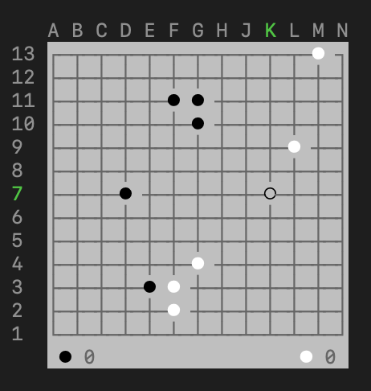

# go.py

[Board games collection repo](https://github.com/956MB/board-games)

```shell
   A B C D E F G H J K L M N
13 ┌─┬─┬─┬─┬─┬─┬─┬─┬─┬─┬─● ┐  ···········1·
12 ├─┼─┼─┼─┼─┼─┼─┼─┼─┼─┼─┼─┤  ·············
11 ├─┼─┼─┼─┼─○ ○ ┼─┼─┼─┼─┼─┤  ·····00······
10 ├─┼─┼─┼─┼─┼─○ ┼─┼─┼─┼─┼─┤  ······0······
9  ├─┼─┼─┼─┼─┼─┼─┼─┼─┼─● ┼─┤  ··········1··
8  ├─┼─┼─┼─┼─┼─┼─┼─┼─┼─┼─┼─┤  ·············
7  ├─┼─┼─┼─┼─┼─┼─┼─┼─○─┼─┼─┤  ·············
6  ├─┼─┼─○ ┼─┼─┼─┼─┼─┼─┼─┼─┤  ···0·········
5  ├─┼─┼─┼─┼─┼─┼─┼─┼─┼─┼─┼─┤  ·············
4  ├─┼─┼─┼─┼─┼─● ┼─┼─┼─┼─┼─┤  ······1······
3  ├─┼─┼─┼─○ ● ┼─┼─┼─┼─┼─┼─┤  ····01·······
2  ├─┼─┼─┼─┼─● ┼─┼─┼─┼─┼─┼─┤  ·····1·······
1  └─┴─┴─┴─┴─┴─┴─┴─┴─┴─┴─┴─┘  ·············
    ● 0                 ● 0 
```

Usage:

```shell
usage: go.py [-h] [-V] [-e] [-d] [-t [{0,1}]]
             [-s [{9,13,19}]]
             [-c [{41,42,43,44,45,46,47}]]

Play Go in the terminal. Written in Python.

optional arguments:
  -h, --help            show this help message
                        and exit
  -V, --version         show script version
  -e, --extra           show extra game info
                        after win
  -d, --debug           show debug info about
                        the game while playing
  -t [{0,1}], --turn [{0,1}]
                        set starting piece.
                        Blue/Red (0, 1)
  -s [{9,13,19}], --size [{9,13,19}]
                        choose to select the
                        board size, instead of
                        the default 19x19
  -c [{41,42,43,44,45,46,47}], --color [{41,42,43,44,45,46,47}]
                        choose to select the
                        color for board
                        background color,
                        instead of random on
                        load
```

